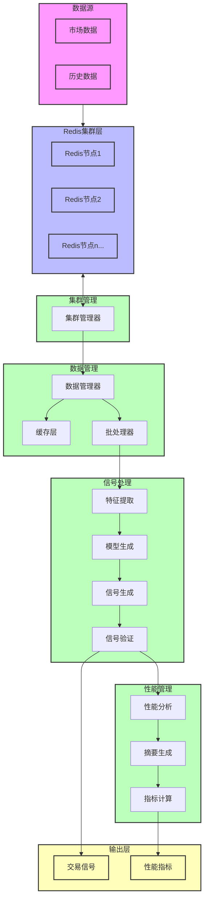

# AlgoEngine 算法引擎

AlgoEngine 是一个高性能的算法交易引擎，专为信号生成、数据管理和性能分析而设计。它提供了一个灵活且可扩展的框架，用于实现具有实时数据处理能力的交易策略。

## 核心组件

### 1. 数据管理器 (`dataMgr.py`)
数据管理器负责高效的数据处理和管理：
- 异步数据加载和处理
- Redis 集群集成，用于分布式数据存储
- 高效的历史数据缓存机制
- 支持实时和离线数据处理
- 可配置的数据批处理，具有可自定义的节点限制

### 2. 信号管理器 (`signalMgr.py`)
信号管理器处理信号生成和处理：
- 动态加载信号生成策略
- 信号拦截和验证
- 特征生成和管理
- 支持实时和批量信号处理
- 灵活的时间延迟配置

### 3. 性能管理器 (`performanceMgr.py`)
性能管理器评估和分析交易性能：
- 动态加载性能评估方法
- 支持自定义性能指标
- 性能摘要生成和分析
- 信号性能跟踪和评估
- 性能数据缓存管理

### 4. 集群管理器 (`clusterMgr.py`)
集群管理器处理分布式数据存储：
- Redis 集群管理
- 支持本地和分布式部署
- 高效的批量数据检索
- 基于标签的数据查询

## 主要特性

- **异步处理**：使用 Python 的 asyncio 实现高性能并发操作
- **模块化设计**：每个组件都是独立且可扩展的
- **动态加载**：支持交易策略和性能指标的热重载
- **分布式架构**：可扩展的 Redis 集群支持设计
- **灵活配置**：可自定义的交易场景参数
- **实时处理**：高效处理实时市场数据
- **性能优化**：实现缓存和批处理以优化性能

## 系统架构

上图展示了详细的数据流和处理流程：

1. **数据源**
   - 市场数据和历史数据输入
   - 支持多数据源

2. **Redis集群层**
   - 分布式数据存储
   - 多个Redis节点实现可扩展性
   - 数据分片和复制

3. **集群管理**
   - 协调Redis集群操作
   - 管理数据分发和节点健康

4. **数据管理**
   - 高效的数据检索和缓存
   - 优化性能的批处理
   - 数据同步和一致性

5. **信号处理**
   - 从原始数据提取特征
   - 基于模型的信号生成
   - 信号验证和过滤
   - 支持实时和批量处理

6. **性能管理**
   - 全面的性能分析
   - 策略评估的摘要生成
   - 关键指标计算和跟踪

7. **输出层**
   - 用于执行的交易信号
   - 用于分析的性能指标
   - 实时监控和报告

## 安装

本包是 `algohood_strategy` 的依赖项，安装主包时会自动安装：

## 环境要求

Python 3.10+ 以及 `pyproject.toml` 中列出的依赖项

## 贡献指南

欢迎贡献！请遵循以下步骤：
1. Fork 仓库
2. 创建功能分支
3. 提交 Pull Request

## 许可证

专有许可证（联系 AlgoHood 获取许可详情） 