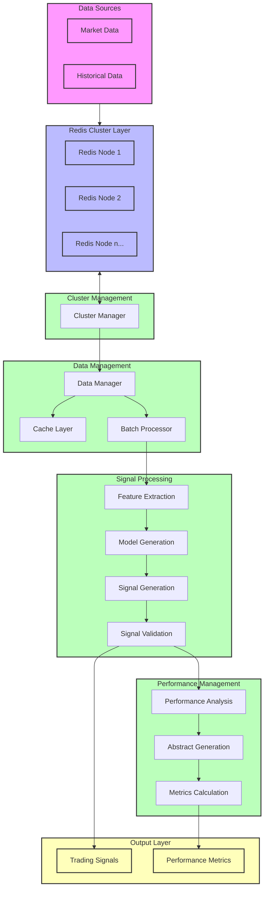

# AlgoEngine

AlgoEngine is a high-performance algorithmic trading engine designed for signal generation, data management, and performance analysis. It provides a flexible and extensible framework for implementing trading strategies with real-time data processing capabilities.

## Core Components

### 1. DataManager (`dataMgr.py`)
The DataManager is responsible for efficient data handling and management:
- Asynchronous data loading and processing
- Redis cluster integration for distributed data storage
- Efficient caching mechanism for historical data
- Support for real-time and offline data processing
- Configurable data batch processing with customizable node limits

### 2. SignalManager (`signalMgr.py`)
The SignalManager handles signal generation and processing:
- Dynamic loading of signal generation strategies
- Signal interception and validation
- Feature generation and management
- Support for both real-time and batch signal processing
- Flexible time lag configuration for signal generation

### 3. PerformanceManager (`performanceMgr.py`)
The PerformanceManager evaluates and analyzes trading performance:
- Dynamic loading of performance evaluation methods
- Support for custom performance metrics
- Abstract generation for performance analysis
- Signal performance tracking and evaluation
- Cache management for performance data

### 4. ClusterManager (`clusterMgr.py`)
The ClusterManager handles distributed data storage:
- Redis cluster management
- Support for both local and distributed deployments
- Efficient batch data retrieval
- Label-based data querying

## Key Features

- **Asynchronous Processing**: Built with Python's asyncio for high-performance concurrent operations
- **Modular Design**: Each component is independent and extensible
- **Dynamic Loading**: Support for hot-reloading of trading strategies and performance metrics
- **Distributed Architecture**: Scalable design with Redis cluster support
- **Flexible Configuration**: Customizable parameters for different trading scenarios
- **Real-time Processing**: Efficient handling of real-time market data
- **Performance Optimization**: Implemented caching and batch processing for optimal performance

## System Architecture

The diagram above illustrates the detailed data flow and processing pipeline:

1. **Data Sources**
   - Market data and historical data input
   - Multiple data source support

2. **Redis Cluster Layer**
   - Distributed data storage
   - Multiple Redis nodes for scalability
   - Data sharding and replication

3. **Cluster Management**
   - Coordinates Redis cluster operations
   - Manages data distribution and node health

4. **Data Management**
   - Efficient data retrieval and caching
   - Batch processing for optimal performance
   - Data synchronization and consistency

5. **Signal Processing**
   - Feature extraction from raw data
   - Model-based signal generation
   - Signal validation and filtering
   - Real-time and batch processing support

6. **Performance Management**
   - Comprehensive performance analysis
   - Abstract generation for strategy evaluation
   - Key metrics calculation and tracking

7. **Output Layer**
   - Trading signals for execution
   - Performance metrics for analysis
   - Real-time monitoring and reporting

## Installation

This package is a dependency of `algohood_strategy` and will be automatically installed when you install the main package:

## Requirements

Python 3.10+ with dependencies listed in `pyproject.toml`

## Contributing

Contributions welcome! Please follow:
1. Fork the repository
2. Create your feature branch
3. Submit a pull request

## License

Proprietary License (Contact AlgoHood for licensing details)